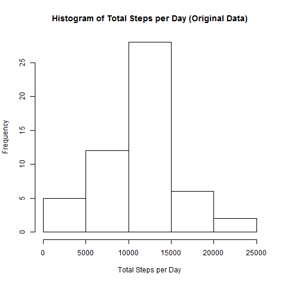
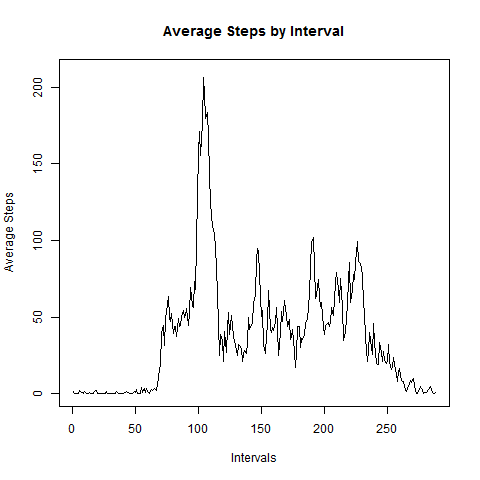
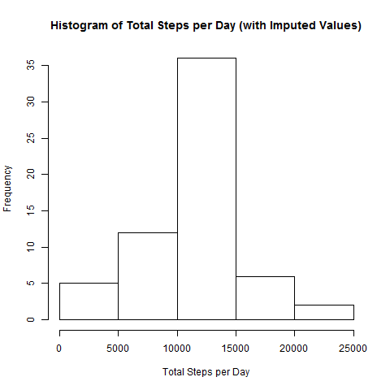
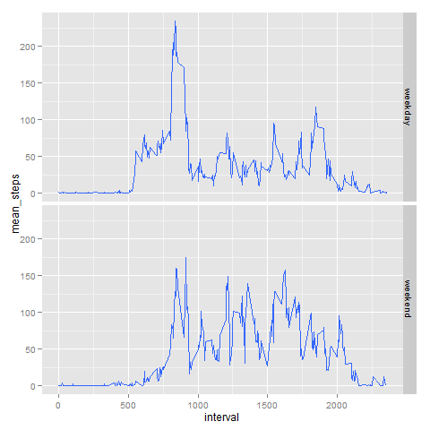

## Reproducible Research - Peer Assignment 1
  
  
#### 1) Loading and Processing the Data

1. Load the data - after downloading and unzipping the provided data to local folder, the first step is to read the csv file from local file.


```r
activity <- read.csv("C:\\Users\\Wu\\Downloads\\activity.csv")
```

2. Process/transform the data into a format suitable for analysis. 

I chose **dplyr** library and converted activity data into data table, and remove lines with missing values for steps.


```r
suppressPackageStartupMessages(library(dplyr))
activity <- tbl_df(activity)
activity_nm <- activity[!is.na(activity$steps), ]
```

#### 2) Calculate mean of total steps taken per day

1. Calculate the total number of steps taken per day

This is done with **summarize** and **group_by** functions from **dplyr**.


```r
step_per_day <- summarize(group_by(activity_nm, date), sum(steps))
names(step_per_day) <- c("date", "sum_steps")
```

A data set containing the step by date summary is generated.


```r
step_per_day
```

```
## Source: local data frame [53 x 2]
## 
##          date sum_steps
## 1  2012-10-02       126
## 2  2012-10-03     11352
## 3  2012-10-04     12116
## 4  2012-10-05     13294
## 5  2012-10-06     15420
## 6  2012-10-07     11015
## 7  2012-10-09     12811
## 8  2012-10-10      9900
## 9  2012-10-11     10304
## 10 2012-10-12     17382
## ..        ...       ...
```

2. Make a histogram of the total number of steps taken each day


```r
hist(step_per_day$sum_steps, 
     main = "Histogram of Total Steps per Day (Original Data)", 
     xlab = "Total Steps per Day")
```

 

It shows that the totals follow roughly normal distribution with median between *10,000* and *15,000*.  

3. Calculate and report the mean and median of the total number of steps taken per day


```r
mean(step_per_day$sum_steps)
```

```
## [1] 10766.19
```

```r
median(step_per_day$sum_steps)
```

```
## [1] 10765
```

The median is very close to the mean value of *10,765* steps per day

#### 3) Calculate average daily activity pattern

1. Make a time series plot of the 5-minute interval and the average number of steps taken, averaged across all days  

First a new summary data set is created for average steps taken per interval.

```r
step_per_interval <- summarize(group_by(activity_nm, interval), mean(steps))
names(step_per_interval) <- c("interval", "mean_steps")
```

Time series plot is then generated with this summary dataset


```r
plot(step_per_interval$mean_steps, type = "l", 
     main = "Average Steps by Interval", 
     xlab = "Intervals", ylab = "Average Steps",
     ylim = range(0, 210))
```

 

2. Find which 5-minute interval, on average across all the days in the dataset, contains the maximum number of steps

In the plot it shows it is around *800~900th* interval, but we can use **which.max** function to find the exact interval


```r
step_per_interval$interval[which.max(step_per_interval$mean_steps)]
```

```
## [1] 835
```

The interval is *835*, which is *8:35-8:40 AM* when most people go to work.

#### 4) Impute missing values

1. Calculate and report the total number of missing values in the dataset (i.e. the total number of rows with NAs)


```r
activity_na <- activity[is.na(activity$steps), ]
dim(activity_na)
```

```
## [1] 2304    3
```

A total of *2304* rows (i.e., *8* days with *288* intervals each) are missing steps values in the dataset. 

2. Fill in all of the missing values in the dataset  

I used **mean of intervals** to fill out all the missing steps in the dataset


```r
activity_impute <- merge(activity_na[, 2:3], step_per_interval, 
                         by.x = "interval", by.y = "interval")
names(activity_impute) = c("interval", "date", "steps")
```

3. Create a new dataset that is equal to the original dataset but with the missing data filled in  

The subset with imputed values are combined with original subset without missing values


```r
activity_new <- rbind(activity_nm, activity_impute)
tail(activity_new)
```

```
## Source: local data frame [6 x 3]
## 
##      steps       date interval
## 1 1.075472 2012-11-01     2355
## 2 1.075472 2012-10-08     2355
## 3 1.075472 2012-11-04     2355
## 4 1.075472 2012-11-09     2355
## 5 1.075472 2012-10-01     2355
## 6 1.075472 2012-11-30     2355
```

4. Make a histogram of the total number of steps taken each day and calculate and report the mean and median values. 


```r
step_per_day_new <- summarize(group_by(activity_new, date), sum(steps))
names(step_per_day_new) <- c("date", "sum_steps")
hist(step_per_day_new$sum_steps, 
     main = "Histogram of Total Steps per Day (with Imputed Values)", 
     xlab = "Total Steps per Day")
```

 

```r
mean(step_per_day_new$sum_steps)
```

```
## [1] 10766.19
```

```r
median(step_per_day_new$sum_steps)
```

```
## [1] 10766.19
```

The histogram shows similar cuts and shapes for total steps per day with higher frequencies, while mean and median values differ from the estimates from the first part of the assignment only slightly.  

This would have been expected as I used means of non-missing values to impute missing data on the estimates of the total daily number of steps.

## 5) Check for differences in activity patterns between weekdays and weekends

1. Create a new factor variable in the dataset with two levels ??? ???weekday??? and ???weekend??? indicating whether a given date is a weekday or weekend day


```r
wd <- factor(weekdays(as.Date(as.character(activity_nm$date))))
levels(wd) <- c("weekday","weekday","weekend","weekend",
                "weekday","weekday","weekday")
activity_nm$day <- wd
```

Please note that I added this new factor to subset with non-missing values only. But the results should not be very different. 

2. Make a panel plot containing a time series plot of the 5-minute interval and the average number of steps taken, averaged across all weekday days or weekend days


```r
library(ggplot2)

step_per_interval_day <- summarize(group_by(activity_nm, interval, day), mean(steps))
names(step_per_interval_day) <- c("interval", "day", "mean_steps")
ggplot(step_per_interval_day, aes(interval, mean_steps)) + geom_smooth(stat="identity") + facet_grid(day ~ .)
```

 

From the panel plot, it is clear that there are different patterns between weekend days and weekdays. During weekdays, the total steps peak in the early morning with significant higher values (~*250*) than minor peaks (~*100*) in the afternoon. During weekend though, there are multiple peaks throughout the day, with values varied from *100* to *150*.
